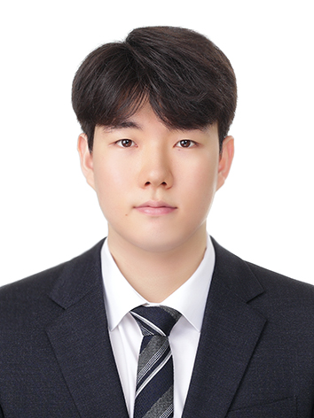

# About Us

We are a team based in the [School of Computing, National University of Singapore](http://www.comp.nus.edu.sg).

You can reach us at the email `seer[at]comp.nus.edu.sg`

## Project team

### Keith Cheng

[[homepage](https://keithcheng.vercel.app/)]
[[github](https://github.com/KeithCheng22)]

<!-- [[portfolio](team/johndoe.md)] -->

- Role: Project Advisor

### Nivanth Naricitty

[[github](http://github.com/nivanthn)]

- Role: Team Member
- Responsibilities: UI, Data

### Kim Suhan

[[github](https://github.com/SuhanKim96)]

- Role: Developer
- Responsibilities: Data

### Jean Doe

[[github](http://github.com/johndoe)]
[[portfolio](team/johndoe.md)]

- Role: Developer
- Responsibilities: Dev Ops + Threading

### Chan Jan Hoe

[[github](http://github.com/NUSOffisher)]
<!-- [[portfolio](team/johndoe.md)] -->

- Role: Developer
- Responsibilities: UI
